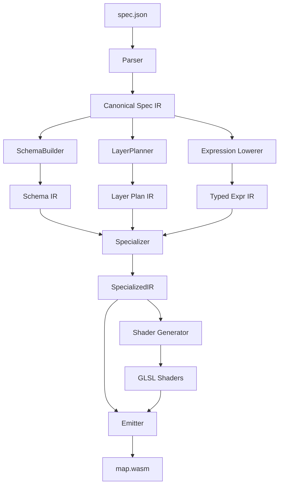

# Compilation Pipeline

The Terra Map Compiler transforms a high-level declarative map specification into a low-level, specialized WebAssembly renderer.

## Pipeline Overview

## Stages

1.  **Parser**: Reads the JSON spec and validates basic syntax.
2.  **Canonicalizer**: Normalizes the spec, fills in defaults, and resolves references.
3.  **Schema Builder**: Infers or validates the source data schema (properties, types) needed for the map.
4.  **Layer Planner**: Decides how each layer will be rendered (shader choice, draw order, batching).
5.  **Expression Lowerer**: Converts style expressions (e.g., `["get", "class"]`) into a typed AST.
6.  **Specializer**: The core optimization step. It:
    *   Evaluates constant expressions.
    *   Prunes dead branches based on schema knowledge.
    *   Hoists invariant calculations (per-frame vs per-feature).
7.  **Shader Gen**: Generates optimized GLSL shaders specific to the active layers.
8.  **Emitter**: Uses Terra/LLVM to compile the logic into a standalone WebAssembly module.

## Output

The final artifact is `map.wasm`, a single binary containing:
*   The runtime logic (tile decoding, command generation).
*   Embedded static data (shaders, lookup tables).
*   Exported ABI functions for the host.
