# Terra AOT Map Compiler Architecture and Contracts

## Complete Diagram Document

## Purpose

This document maps the full architecture, subsystem boundaries, binary contracts, lifecycle flows, and implementation surfaces of the Terra ahead-of-time map compiler system.

All diagrams use Mermaid. The goal is to give both human developers and AI coding agents a complete navigational map of the system.

This document is intentionally redundant in places. It is meant to be used as a reference atlas, not just read front to back.

---

## 1. System context

The system has two runtime halves and one design-time half:

- a **Terra/Lua compiler service**,
- a **generated Wasm renderer module**,
- a **thin browser host**.

The compiler service transforms a map specification into a specialized Wasm renderer. The browser host provides canvas, WebGL2, event forwarding, fetch, timing, and command submission. The generated Wasm module owns all map logic.

### 1.1 Context diagram

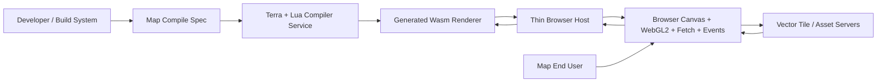

### 1.2 Responsibility split

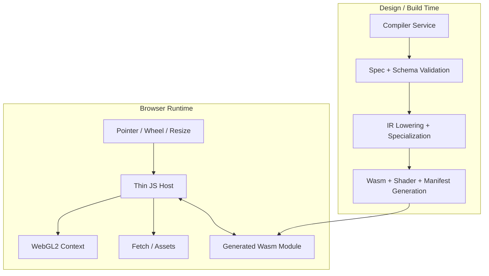

---

## 2. Top-level architecture

### 2.1 Full system architecture

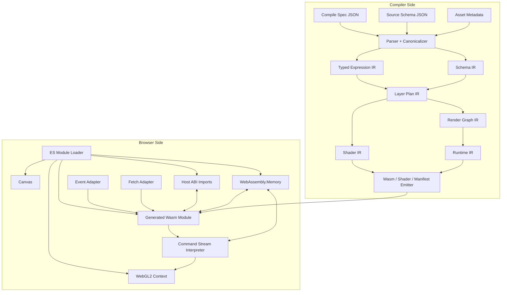

### 2.2 Runtime philosophy

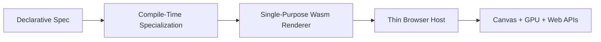

---

## 3. Repository and module map

### 3.1 Repository structure

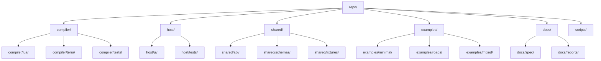

### 3.2 Module dependency map

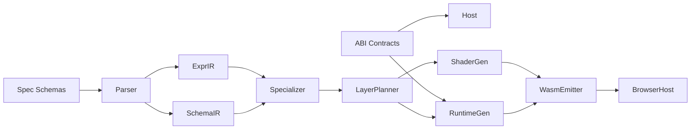

---

## 4. Build-time compiler pipeline

### 4.1 Compiler pipeline overview

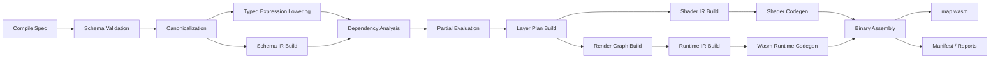

### 4.2 Compiler activity diagram

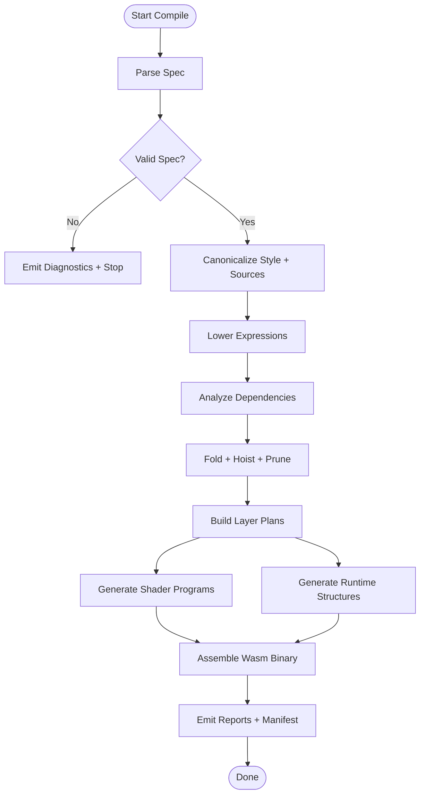

### 4.3 Compiler subsystems

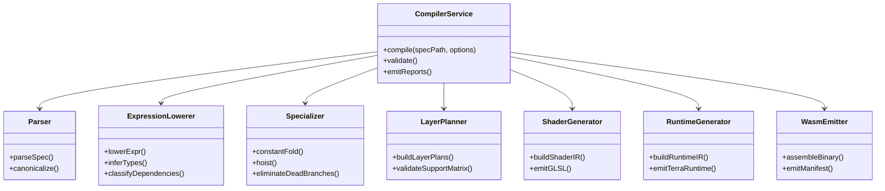

---

## 5. Input contracts

### 5.1 Input document structure

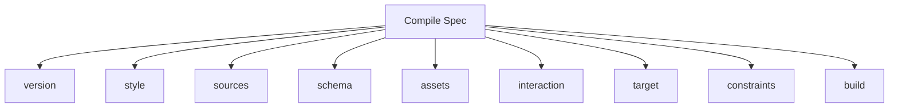

### 5.2 Input validation flow

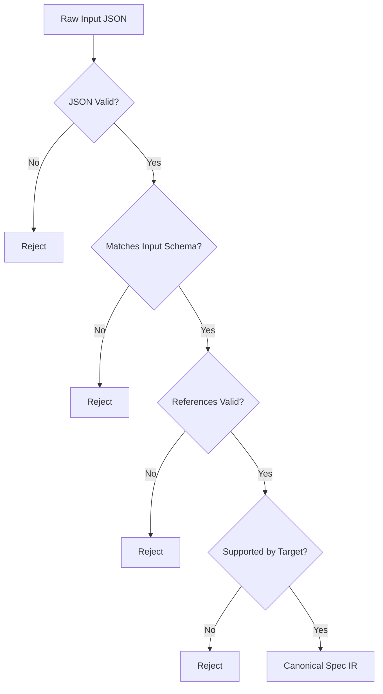

### 5.3 Source schema model

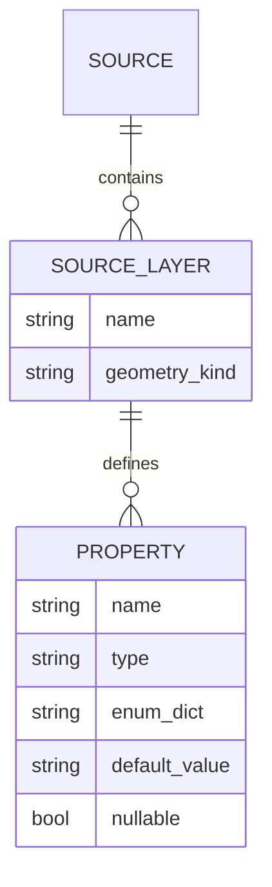

---

## 6. Intermediate representations

### 6.1 IR stack

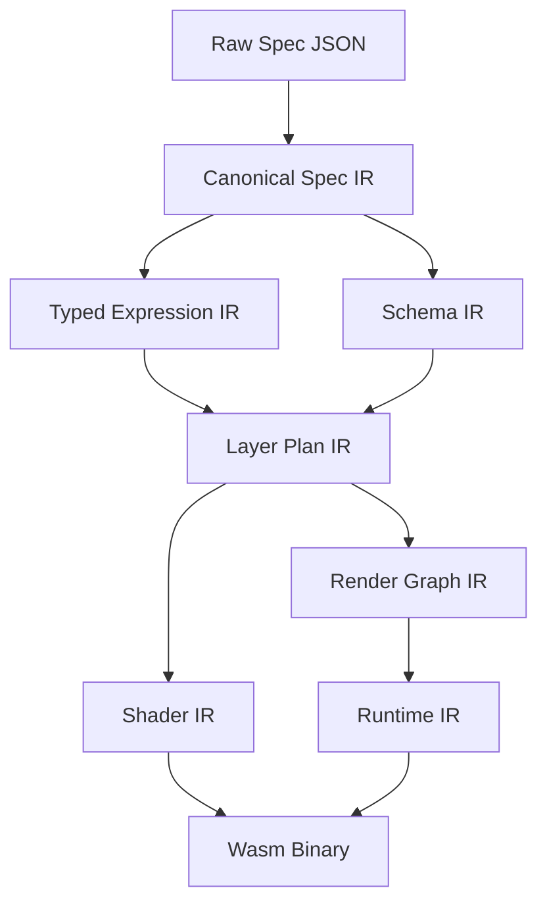

### 6.2 IR dependency chain

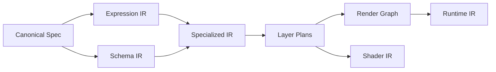

### 6.3 Expression IR object model

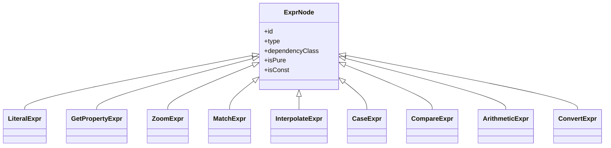

### 6.4 Dependency class lattice

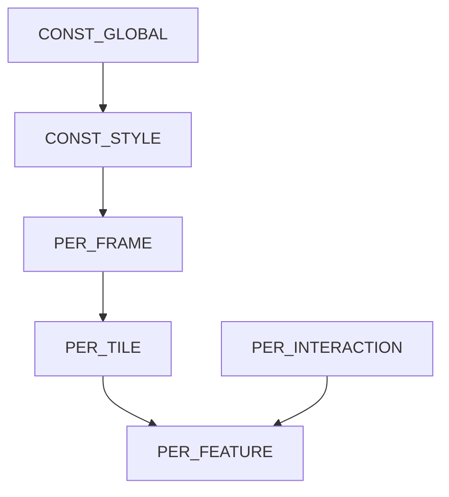

---

## 7. Specialization model

### 7.1 Specialization pass overview

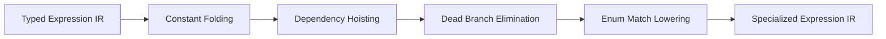

### 7.2 Expression evaluation classes by lifetime

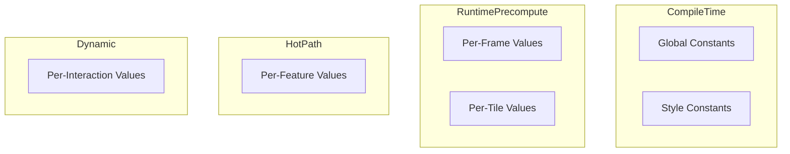

### 7.3 Example transformation

```mermaid
flowchart LR
    Input[match(get class) motorway->4 primary->2 default->1] --> Slot[get slot CLASS]
    Slot --> Enum[enum id lookup]
    Enum --> Switch[dense switch]
    Switch --> Output[per-feature evaluator]
```

---

## 8. Layer planning and render graph

### 8.1 Layer plan composition

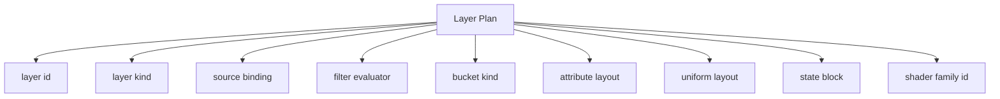

### 8.2 Supported layer families for v0

```mermaid
flowchart LR
    Layers[Compiled Layers] --> Background
    Layers --> Fill
    Layers --> Line
    Layers --> Circle
```

### 8.3 Render graph ordering

```mermaid
flowchart TD
    Begin[Frame Begin] --> BackgroundPass[Background Pass]
    BackgroundPass --> FillPass[Fill Pass]
    FillPass --> LinePass[Line Pass]
    LinePass --> CirclePass[Circle Pass]
    CirclePass --> End[Frame End]
```

### 8.4 Layer plan state relationships

```mermaid
classDiagram
    class LayerPlan {
        +layerId
        +kind
        +sourceId
        +filterExprId
        +bucketKind
        +attributeLayoutId
        +uniformLayoutId
        +stateBlockId
        +shaderProgramKey
    }

    class StateBlock {
        +blendMode
        +depthMode
        +cullMode
        +viewportPolicy
    }

    class AttributeLayout {
        +layoutId
        +stride
        +fields
    }

    class UniformLayout {
        +layoutId
        +fields
    }

    LayerPlan --> StateBlock
    LayerPlan --> AttributeLayout
    LayerPlan --> UniformLayout
```

---

## 9. Shader generation architecture

### 9.1 Shader generation flow

```mermaid
flowchart LR
    LayerPlan[Layer Plan] --> ShaderFamily[Shader Family Builder]
    SpecializedExpr[Specialized Expressions] --> ShaderFamily
    ShaderFamily --> ShaderIR[Shader IR]
    ShaderIR --> GLSL[GLSL Generator]
    GLSL --> ProgramManifest[Program Manifest]
```

### 9.2 Shader contracts

```mermaid
flowchart TB
    Program[Shader Program]
    Program --> VertexInputs[Vertex Inputs]
    Program --> Uniforms[Uniforms]
    Program --> Varyings[Varyings]
    Program --> FragmentOutputs[Fragment Outputs]
    Program --> Constants[Embedded Constants]
```

### 9.3 Shader program family map

```mermaid
flowchart LR
    ShaderPrograms[Compiled Program Families] --> FillShader[Fill Program]
    ShaderPrograms --> LineShader[Line Program]
    ShaderPrograms --> CircleShader[Circle Program]
```

### 9.4 Shader reflection relationship

```mermaid
classDiagram
    class ProgramManifest {
        +programId
        +programKey
        +vertexShaderName
        +fragmentShaderName
    }

    class AttributeBinding {
        +name
        +location
        +type
        +offset
        +stride
    }

    class UniformBinding {
        +name
        +bindingId
        +type
    }

    ProgramManifest --> AttributeBinding
    ProgramManifest --> UniformBinding
```

---

## 10. Runtime architecture inside generated Wasm

### 10.1 Runtime subsystem map

```mermaid
flowchart TB
    Runtime[Generated Wasm Runtime]
    Runtime --> MemoryMgr[Memory Manager]
    Runtime --> Camera[Camera Subsystem]
    Runtime --> TileMgr[Tile Manager]
    Runtime --> Decoder[Tile Decoder]
    Runtime --> BucketBuilder[Bucket Builders]
    Runtime --> Visibility[Visibility + Culling]
    Runtime --> ResourceReg[Resource Registry]
    Runtime --> CmdEncoder[Command Encoder]
    Runtime --> Events[Event Handlers]
    Runtime --> Diagnostics[Diagnostics Ring]
```

### 10.2 Runtime state composition

```mermaid
classDiagram
    class RuntimeState {
        +cameraState
        +tileCache
        +resourceRegistry
        +frameArena
        +decodeArena
        +commandArena
        +stats
        +diagnostics
    }

    class CameraState
    class TileCache
    class ResourceRegistry
    class Arena
    class Stats
    class DiagnosticsRing

    RuntimeState --> CameraState
    RuntimeState --> TileCache
    RuntimeState --> ResourceRegistry
    RuntimeState --> Arena
    RuntimeState --> Stats
    RuntimeState --> DiagnosticsRing
```

### 10.3 Wasm exports and imports map

```mermaid
flowchart LR
    subgraph WasmExports[Wasm Exports]
        Init[init]
        Frame[frame]
        Resize[resize]
        PMove[pointer_move]
        PDown[pointer_down]
        PUp[pointer_up]
        Wheel[wheel]
        Key[key_event]
        Loaded[resource_loaded]
        Failed[resource_failed]
    end

    subgraph HostImports[Host Imports]
        Now[now_ms]
        Log[log]
        RAF[request_frame]
        CSize[canvas_size]
        Submit[submit_commands]
        Fetch[fetch_start]
        Release[resource_release]
    end
```

---

## 11. Browser host architecture

### 11.1 Thin host composition

```mermaid
flowchart TB
    Host[Thin Browser Host]
    Host --> Loader[Wasm Loader]
    Host --> CanvasMgr[Canvas Manager]
    Host --> GLContext[WebGL2 Context Manager]
    Host --> ImportTable[Host Import Table]
    Host --> EventBridge[Event Bridge]
    Host --> FetchBridge[Fetch Bridge]
    Host --> CmdInterp[Command Interpreter]
    Host --> ResourceTables[Host Resource Tables]
```

### 11.2 Browser host runtime loop

```mermaid
flowchart TD
    Start([Load Host]) --> CreateCanvas[Create / Acquire Canvas]
    CreateCanvas --> CreateGL[Create WebGL2 Context]
    CreateGL --> CreateMemory[Create WebAssembly.Memory]
    CreateMemory --> Instantiate[Instantiate Wasm]
    Instantiate --> Init[Call init()]
    Init --> Resize[Call resize()]
    Resize --> Frame[Call frame()]
    Frame --> Wait[Wait for requestAnimationFrame or events]
    Wait --> Frame
```

### 11.3 Host resource tables

```mermaid
flowchart LR
    ResourceTables[Host Resource Tables] --> Programs[program handle -> WebGLProgram]
    ResourceTables --> Buffers[buffer handle -> WebGLBuffer]
    ResourceTables --> Textures[texture handle -> WebGLTexture]
    ResourceTables --> Fetches[req id -> pending fetch]
```

---

## 12. Shared memory contract

### 12.1 Memory overview

```mermaid
flowchart TB
    Memory[WebAssembly.Memory]
    Memory --> Header[Module Header]
    Memory --> GlobalState[Global State]
    Memory --> TileCache[Tile Cache Region]
    Memory --> LongHeap[Long-Lived Heap]
    Memory --> FrameArena[Frame Arena]
    Memory --> DecodeArena[Decode Arena]
    Memory --> CommandArena[Command Arena]
    Memory --> UploadArena[Upload Staging Arena]
    Memory --> Diagnostics[Diagnostics Ring Buffer]
```

### 12.2 Memory ownership model

```mermaid
flowchart LR
    JS[Browser Host JS] <--> SharedMemory[Shared Linear Memory]
    Wasm[Generated Wasm] <--> SharedMemory
    JS --> ReadOffsets[Read offsets / lengths]
    Wasm --> WriteBuffers[Write structs / commands / payloads]
```

### 12.3 Struct convention

```mermaid
flowchart TB
    Structs[Externally Visible Structs]
    Structs --> Versioned[Versioned]
    Structs --> LittleEndian[Little-endian]
    Structs --> Aligned[4-byte aligned minimum]
    Structs --> PtrLen[{ptr,len} for variable-length regions]
```

### 12.4 Shared memory access discipline

```mermaid
sequenceDiagram
    participant Wasm as Wasm Module
    participant Mem as Shared Memory
    participant Host as Browser Host

    Wasm->>Mem: write command stream bytes
    Wasm->>Host: submit_commands(ptr,len)
    Host->>Mem: read header
    Host->>Mem: read commands
    Host->>Host: validate bounds and handles
    Host->>Host: execute WebGL calls
```

---

## 13. Host ABI contract map

### 13.1 ABI overview

```mermaid
flowchart LR
    Wasm[Generated Wasm] -- imports --> HostABI[Host ABI]
    HostABI -- services --> Time[Timing]
    HostABI -- services --> Canvas[Canvas Info]
    HostABI -- services --> Fetch[Resource Fetch]
    HostABI -- services --> Submit[Command Submission]
    HostABI -- services --> Logging[Diagnostics]
```

### 13.2 Import/export contract matrix

```mermaid
flowchart TB
    subgraph Imports
        I1[now_ms]
        I2[log]
        I3[request_frame]
        I4[canvas_size]
        I5[submit_commands]
        I6[fetch_start]
        I7[resource_release]
    end

    subgraph Exports
        E1[init]
        E2[frame]
        E3[resize]
        E4[pointer_move]
        E5[pointer_down]
        E6[pointer_up]
        E7[wheel]
        E8[key_event]
        E9[resource_loaded]
        E10[resource_failed]
    end
```

### 13.3 Status code model

```mermaid
stateDiagram-v2
    [*] --> OK
    [*] --> RETRY_LATER
    [*] --> INVALID_ARGUMENT
    [*] --> OUT_OF_MEMORY
    [*] --> UNSUPPORTED
    [*] --> INTERNAL_ERROR
```

---

## 14. Command stream protocol

### 14.1 Command stream stack

```mermaid
flowchart TB
    FrameBuffer[Frame Command Buffer]
    FrameBuffer --> FrameHeader[Frame Header]
    FrameBuffer --> Commands[Command Records]
    Commands --> CmdHeader[opcode + size]
    Commands --> Payload[payload bytes]
```

### 14.2 Command interpreter flow

```mermaid
flowchart TD
    Start([submit_commands]) --> Bounds{Bounds valid?}
    Bounds -- No --> Reject[Reject + log]
    Bounds -- Yes --> Header{Header valid?}
    Header -- No --> Reject
    Header -- Yes --> Loop[Iterate commands]
    Loop --> Opcode{Known opcode?}
    Opcode -- No --> Reject
    Opcode -- Yes --> Validate[Validate payload]
    Validate --> Execute[Execute WebGL action]
    Execute --> More{More commands?}
    More -- Yes --> Loop
    More -- No --> Done([Frame complete])
```

### 14.3 Opcode taxonomy

```mermaid
flowchart TB
    Opcodes[Command Opcodes]
    Opcodes --> FrameOps[BEGIN_FRAME / END_FRAME]
    Opcodes --> StateOps[CLEAR / SET_VIEWPORT / SET_BLEND_STATE]
    Opcodes --> ResourceOps[CREATE_BUFFER / UPLOAD_BUFFER / DESTROY_BUFFER]
    Opcodes --> ProgramOps[USE_PROGRAM / DESTROY_PROGRAM]
    Opcodes --> BindOps[BIND_VERTEX_BUFFER / BIND_INDEX_BUFFER / SET_UNIFORM_BLOCK]
    Opcodes --> DrawOps[DRAW_ARRAYS / DRAW_INDEXED]
```

### 14.4 Command stream object relationships

```mermaid
classDiagram
    class FrameHeader {
        +magic
        +version_major
        +version_minor
        +frame_id
        +command_count
        +flags
    }

    class CommandHeader {
        +opcode
        +size
    }

    class CmdUseProgram
    class CmdBindVertexBuffer
    class CmdDrawIndexed
    class CmdClear

    FrameHeader --> CommandHeader
    CommandHeader <|-- CmdUseProgram
    CommandHeader <|-- CmdBindVertexBuffer
    CommandHeader <|-- CmdDrawIndexed
    CommandHeader <|-- CmdClear
```

---

## 15. Tile and resource lifecycle

### 15.1 Tile state machine

```mermaid
stateDiagram-v2
    [*] --> UNREQUESTED
    UNREQUESTED --> REQUESTING
    REQUESTING --> READY_RAW
    REQUESTING --> FAILED
    READY_RAW --> DECODING
    DECODING --> READY_BUCKETED
    DECODING --> FAILED
    READY_BUCKETED --> EVICTED
    FAILED --> REQUESTING
    EVICTED --> REQUESTING
```

### 15.2 Tile request and decode flow

```mermaid
sequenceDiagram
    participant Wasm as Wasm Runtime
    participant Host as Browser Host
    participant Net as Network
    participant Mem as Shared Memory

    Wasm->>Host: fetch_start(req_id, url)
    Host->>Net: fetch(url)
    Net-->>Host: bytes
    Host->>Mem: copy response bytes
    Host->>Wasm: resource_loaded(req_id, status, ptr, len)
    Wasm->>Wasm: decode tile
    Wasm->>Wasm: build buckets
    Wasm->>Wasm: mark tile READY_BUCKETED
```

### 15.3 Tile manager composition

```mermaid
classDiagram
    class TileManager {
        +selectVisibleTiles()
        +requestMissingTiles()
        +evictUnusedTiles()
        +handleResourceLoaded()
    }

    class TileEntry {
        +tileId
        +state
        +rawPtr
        +decodedPtr
        +bucketPtrs
        +lastUsedFrame
    }

    TileManager --> TileEntry
```

### 15.4 Cache eviction policy

```mermaid
flowchart TD
    Visible[Visible Tile Set] --> Mark[Mark in-use tiles]
    Mark --> SizeCheck{Cache over budget?}
    SizeCheck -- No --> Keep[Keep cache]
    SizeCheck -- Yes --> Sort[Sort candidates by last used]
    Sort --> Evict[Evict oldest unused]
    Evict --> Keep
```

---

## 16. Decoder and schema projection

### 16.1 Decode pipeline

```mermaid
flowchart LR
    RawTile[Raw Tile Bytes] --> DecodeGeom[Decode Geometry]
    RawTile --> DecodeProps[Decode Referenced Properties Only]
    DecodeProps --> Project[Project into Schema Slots]
    DecodeGeom --> FeatureRecords[Typed Feature Records]
    Project --> FeatureRecords
```

### 16.2 Property access lowering path

```mermaid
flowchart LR
    StyleAccess[get("class")] --> SchemaLookup[Lookup property in schema]
    SchemaLookup --> SlotAssign[Assign stable slot]
    SlotAssign --> EnumDict[Optional enum dictionary]
    EnumDict --> SlotAccess[slot load at runtime]
```

### 16.3 Feature record model

```mermaid
classDiagram
    class FeatureRecord {
        +geometryKind
        +geometryPtr
        +propertySlotsPtr
        +propertyMask
    }

    class PropertySlot {
        +slotId
        +typeTag
        +value
    }

    FeatureRecord --> PropertySlot
```

---

## 17. Bucket building

### 17.1 Bucket build pipeline

```mermaid
flowchart LR
    Features[Typed Feature Records] --> FilterEval[Filter Evaluator]
    FilterEval --> AttrEval[Per-Feature Attribute Evaluation]
    AttrEval --> Pack[Pack Vertices + Indices]
    Pack --> Bounds[Compute Bounds]
    Bounds --> Bucket[Ready Bucket]
```

### 17.2 Bucket families

```mermaid
flowchart TB
    Buckets[Bucket Types]
    Buckets --> FillBucket
    Buckets --> LineBucket
    Buckets --> CircleBucket
```

### 17.3 Bucket object model

```mermaid
classDiagram
    class Bucket {
        +tileId
        +layerId
        +vertexRange
        +indexRange
        +bounds
        +sortKey
        +uniformBlockPtr
    }

    class FillBucket
    class LineBucket
    class CircleBucket

    Bucket <|-- FillBucket
    Bucket <|-- LineBucket
    Bucket <|-- CircleBucket
```

### 17.4 Vertex packing relationship

```mermaid
flowchart LR
    LayerFamily[Layer Family] --> AttrLayout[Generated Attribute Layout]
    AttrLayout --> VertexStruct[Packed Vertex Struct]
    VertexStruct --> ShaderInputs[Shader Input Contract]
```

---

## 18. Visibility, culling, and render planning

### 18.1 Visibility pipeline

```mermaid
flowchart LR
    Camera[Camera State] --> VisibleTiles[Visible Tile Selection]
    VisibleTiles --> ReadyBuckets[Ready Bucket Set]
    ReadyBuckets --> BoundsCull[Bucket Bounds Culling]
    BoundsCull --> RenderList[Render List]
```

### 18.2 Frame planning flow

```mermaid
flowchart TD
    Start([frame()]) --> UpdateCam[Update per-frame camera values]
    UpdateCam --> Select[Select visible tiles]
    Select --> Culling[Cull invisible buckets]
    Culling --> Order[Order by pass and layer]
    Order --> Encode[Encode commands]
    Encode --> Submit[submit_commands]
    Submit --> End([frame end])
```

### 18.3 Render list ordering

```mermaid
flowchart TB
    RenderList[Render List] --> BackgroundLayer
    RenderList --> FillLayers
    RenderList --> LineLayers
    RenderList --> CircleLayers
```

---

## 19. GPU resource management

### 19.1 Resource lifecycle

```mermaid
stateDiagram-v2
    [*] --> DECLARED
    DECLARED --> CREATED
    CREATED --> UPLOADED
    UPLOADED --> BOUND
    BOUND --> REUSED
    REUSED --> DESTROYED
    CREATED --> DESTROYED
    UPLOADED --> DESTROYED
```

### 19.2 Resource ownership split

```mermaid
flowchart LR
    Wasm[Wasm Runtime] --> LogicalHandles[Logical Resource Handles]
    Host[Browser Host] --> NativeObjects[WebGL Objects]
    LogicalHandles <--> NativeObjects
```

### 19.3 Program and buffer relationships

```mermaid
classDiagram
    class ResourceRegistry {
        +programHandles
        +bufferHandles
        +textureHandles
    }

    class ProgramHandle {
        +id
        +programKey
    }

    class BufferHandle {
        +id
        +size
        +usage
    }

    ResourceRegistry --> ProgramHandle
    ResourceRegistry --> BufferHandle
```

---

## 20. Frame lifecycle

### 20.1 Full runtime frame sequence

```mermaid
sequenceDiagram
    participant Browser as Browser
    participant Host as JS Host
    participant Wasm as Wasm Module
    participant Mem as Shared Memory
    participant GL as WebGL2

    Browser->>Host: animation frame / event
    Host->>Wasm: frame()
    Wasm->>Wasm: update camera + tile visibility
    Wasm->>Wasm: build render list
    Wasm->>Mem: write command stream
    Wasm->>Host: submit_commands(ptr,len)
    Host->>Mem: parse command stream
    Host->>GL: execute WebGL commands
    GL-->>Host: draw complete
```

### 20.2 Redraw scheduling model

```mermaid
flowchart TD
    Idle[Idle] --> EventOrData{Input or resource change?}
    EventOrData -- No --> Idle
    EventOrData -- Yes --> Dirty[Mark frame dirty]
    Dirty --> Request[request_frame]
    Request --> Frame[frame()]
    Frame --> Idle
```

---

## 21. Event and interaction handling

### 21.1 Browser to Wasm event path

```mermaid
flowchart LR
    BrowserEvents[Pointer / Wheel / Resize / Key] --> EventBridge[Host Event Bridge]
    EventBridge --> ABIExports[Wasm Event Exports]
    ABIExports --> InteractionState[Wasm Interaction State]
    InteractionState --> CameraState[Camera Updates]
    CameraState --> Redraw[Request redraw]
```

### 21.2 Interaction state model

```mermaid
classDiagram
    class InteractionState {
        +dragActive
        +lastPointerX
        +lastPointerY
        +modifiers
        +hoverTarget
        +selectionTarget
    }

    class CameraState {
        +center
        +zoom
        +bearing
        +pitch
    }

    InteractionState --> CameraState
```

### 21.3 Pan/zoom flow

```mermaid
sequenceDiagram
    participant User
    participant Host
    participant Wasm

    User->>Host: drag / wheel input
    Host->>Wasm: pointer_move / wheel
    Wasm->>Wasm: update camera state
    Wasm->>Host: request_frame
    Host->>Wasm: frame()
```

---

## 22. Diagnostics and observability

### 22.1 Diagnostics architecture

```mermaid
flowchart TB
    CompilerDiag[Compiler Diagnostics] --> Reports[Reports / Dumps]
    RuntimeDiag[Runtime Diagnostics Ring] --> HostLogs[Host Logging]
    CommandDiag[Command Validation Errors] --> HostLogs
    ShaderDiag[Shader Compile/Link Errors] --> HostLogs
```

### 22.2 Diagnostics ring flow

```mermaid
sequenceDiagram
    participant Wasm
    participant Mem
    participant Host

    Wasm->>Mem: append diagnostic record
    Host->>Mem: read diagnostics on error/debug poll
    Host->>Host: print or surface diagnostics
```

### 22.3 Debug artifact generation

```mermaid
flowchart LR
    CanonicalSpec[Canonical Spec Dump] --> DebugBundle[Debug Bundle]
    ExprDump[Expression IR Dump] --> DebugBundle
    SpecializationReport[Specialization Report] --> DebugBundle
    LayerPlanDump[Layer Plan Dump] --> DebugBundle
    ShaderManifest[Shader Manifest] --> DebugBundle
    BuildManifest[Build Manifest] --> DebugBundle
```

---

## 23. Versioning and compatibility

### 23.1 Version dimensions

```mermaid
flowchart TB
    Versions[System Versions]
    Versions --> CompilerVersion[Compiler Version]
    Versions --> SpecVersion[Spec Schema Version]
    Versions --> ABIVersion[Host ABI Version]
    Versions --> CmdVersion[Command Stream Version]
    Versions --> ShaderBackendVersion[Shader Backend Version]
```

### 23.2 Compatibility policy

```mermaid
stateDiagram-v2
    [*] --> Major
    Major --> Minor
    Minor --> Patch

    state Major {
        [*] --> BreakingBinaryCompat
    }
    state Minor {
        [*] --> AdditiveCompatible
    }
    state Patch {
        [*] --> BugFixCompatible
    }
```

### 23.3 Version negotiation point

```mermaid
flowchart LR
    Host[Browser Host] --> ReadHeader[Read Module Header]
    ReadHeader --> Compare[Compare ABI Versions]
    Compare --> Compatible{Compatible?}
    Compatible -- Yes --> Instantiate[Continue runtime]
    Compatible -- No --> Abort[Abort with diagnostic]
```

---

## 24. Security and trust boundaries

### 24.1 Trust boundary map

```mermaid
flowchart LR
    UntrustedSpec[Untrusted Input Spec] --> CompilerValidation[Compiler Validation Boundary]
    UntrustedAssets[Untrusted Network Bytes] --> HostFetch[Host Fetch Boundary]
    HostFetch --> WasmDecode[Wasm Decode Boundary]
    WasmCommands[Wasm Command Stream] --> HostValidation[Host Command Validation Boundary]
    HostValidation --> WebGL[WebGL Calls]
```

### 24.2 Hardening points

```mermaid
flowchart TB
    Hardening[Hardening Surfaces]
    Hardening --> InputValidation[Spec validation]
    Hardening --> BoundsChecks[Memory bounds checks]
    Hardening --> CommandValidation[Command stream validation]
    Hardening --> ResourceLimits[Resource size limits]
    Hardening --> HandleValidation[Resource handle validation]
```

---

## 25. End-to-end execution map

### 25.1 End-to-end compile and run sequence

```mermaid
sequenceDiagram
    participant Dev as Developer
    participant Compiler as Terra Compiler
    participant Host as Browser Host
    participant Wasm as Generated Wasm
    participant Net as Asset Server
    participant GL as WebGL2

    Dev->>Compiler: compile(spec, schema, assets)
    Compiler-->>Dev: map.wasm + manifest + reports
    Dev->>Host: load app
    Host->>Wasm: instantiate + init
    Host->>Wasm: resize
    Host->>Wasm: frame
    Wasm->>Host: fetch_start(tile)
    Host->>Net: fetch(tile)
    Net-->>Host: bytes
    Host->>Wasm: resource_loaded(bytes)
    Wasm->>Host: submit_commands(ptr,len)
    Host->>GL: execute draw commands
```

### 25.2 MVP delivery ladder

```mermaid
flowchart TD
    M1[Milestone 1: Clear canvas via command stream] --> M2[Milestone 2: Draw static triangle]
    M2 --> M3[Milestone 3: One fill layer from tile data]
    M3 --> M4[Milestone 4: Fill + line + circle]
    M4 --> M5[Milestone 5: Camera interaction + tile lifecycle]
```

---

## 26. Contract atlas

### 26.1 Contract inventory map

```mermaid
flowchart TB
    Contracts[Contracts]
    Contracts --> InputContract[Compile Input Contract]
    Contracts --> SchemaContract[Source Schema Contract]
    Contracts --> ABIContract[Browser Host ABI]
    Contracts --> MemoryContract[Shared Memory Contract]
    Contracts --> CommandContract[Command Stream Contract]
    Contracts --> ShaderContract[Shader Reflection Contract]
    Contracts --> ResourceContract[Resource Handle Contract]
    Contracts --> DiagnosticsContract[Diagnostics Contract]
    Contracts --> VersionContract[Version Compatibility Contract]
```

### 26.2 Producer-consumer matrix

```mermaid
flowchart LR
    Compiler[Compiler] -->|produces| WasmBin[Wasm Binary]
    Compiler -->|produces| Manifest[Manifest]
    Compiler -->|consumes| CompileSpec[Compile Spec]
    Compiler -->|consumes| SourceSchema[Source Schema]

    Wasm[Generated Wasm] -->|produces| CommandStream[Command Stream]
    Wasm -->|consumes| HostABI[Host ABI]
    Wasm -->|consumes| TileBytes[Tile Bytes]

    Host[Browser Host] -->|produces| WebGLCalls[WebGL Calls]
    Host -->|consumes| CommandStream
    Host -->|consumes| BrowserEvents[Browser Events]
```

---

## 27. Failure maps

### 27.1 Compile-time failure map

```mermaid
flowchart TD
    Parse[Parse] --> Valid{Valid?}
    Valid -- No --> Reject1[Reject input]
    Valid -- Yes --> Support{Supported features?}
    Support -- No --> Reject2[Reject unsupported construct]
    Support -- Yes --> Type{Type-correct expressions?}
    Type -- No --> Reject3[Reject type error]
    Type -- Yes --> Schema{Schema complete?}
    Schema -- No --> Reject4[Reject missing schema]
    Schema -- Yes --> Build[Emit Wasm]
```

### 27.2 Runtime failure map

```mermaid
flowchart TD
    Frame[frame()] --> FetchFail{Fetch failed?}
    FetchFail -- Yes --> Diag1[Diagnostic + retry policy]
    FetchFail -- No --> DecodeFail{Decode failed?}
    DecodeFail -- Yes --> Diag2[Diagnostic + tile failed]
    DecodeFail -- No --> CmdFail{Invalid command stream?}
    CmdFail -- Yes --> Diag3[Reject frame + log]
    CmdFail -- No --> ShaderFail{Shader create/link failed?}
    ShaderFail -- Yes --> Diag4[Log + fail resource]
    ShaderFail -- No --> Render[Render frame]
```

---

## 28. AI agent implementation map

### 28.1 Suggested build order diagram

```mermaid
flowchart TD
    ABI[Lock Host ABI] --> Memory[Lock Shared Memory Layout]
    Memory --> Command[Lock Command Stream]
    Command --> Host[Build Thin Browser Host]
    Host --> Fake[Build Fake Wasm Producer]
    Fake --> Input[Lock Input Schemas]
    Input --> Parser[Build Canonical Parser]
    Parser --> Expr[Build Typed Expression IR]
    Expr --> Specialize[Build Specialization Passes]
    Specialize --> Plan[Build Layer Plan IR]
    Plan --> Decode[Build Decoder]
    Decode --> Buckets[Build Bucket Builders]
    Buckets --> Shaders[Build Shader Generator]
    Shaders --> Runtime[Build Wasm Runtime Generator]
    Runtime --> Tiles[Build Tile Lifecycle]
    Tiles --> Render[Build Render Command Emission]
    Render --> Interact[Build Interaction]
    Interact --> Debug[Build Diagnostics + Reports]
```

### 28.2 Ownership map by subsystem

```mermaid
flowchart TB
    subgraph CompilerOwnership
        ParseO[Parser]
        ExprO[Expression IR]
        SpecO[Specialization]
        PlanO[Layer Plans]
        ShaderO[Shader Gen]
        RuntimeO[Runtime Gen]
    end

    subgraph SharedOwnership
        ABIO[ABI Docs]
        MemO[Memory Layout]
        CmdO[Command Stream]
        SchemaO[Schemas]
    end

    subgraph HostOwnership
        LoaderO[Loader]
        EventO[Event Bridge]
        FetchO[Fetch Bridge]
        InterpO[Command Interpreter]
        ResourceO[Resource Tables]
    end
```

---

## 29. Minimal reference scenarios

### 29.1 Scenario A: Clear-only module

```mermaid
sequenceDiagram
    participant Host
    participant Wasm
    participant GL

    Host->>Wasm: init()
    Host->>Wasm: frame()
    Wasm->>Host: submit_commands(clear frame)
    Host->>GL: clear()
```

### 29.2 Scenario B: Static triangle module

```mermaid
sequenceDiagram
    participant Host
    participant Wasm
    participant GL

    Host->>Wasm: init()
    Host->>Wasm: frame()
    Wasm->>Host: submit_commands(create/upload/draw)
    Host->>GL: createProgram + createBuffer + drawArrays
```

### 29.3 Scenario C: One fill layer from vector tile

```mermaid
sequenceDiagram
    participant Host
    participant Wasm
    participant Net
    participant GL

    Host->>Wasm: frame()
    Wasm->>Host: fetch_start(tile)
    Host->>Net: fetch(tile)
    Net-->>Host: tile bytes
    Host->>Wasm: resource_loaded(bytes)
    Wasm->>Wasm: decode + bucket build
    Wasm->>Host: submit_commands(draw fill)
    Host->>GL: drawIndexed
```

---

## 30. Final architecture summary

### 30.1 The whole system in one diagram

```mermaid
flowchart TB
    subgraph BuildTime
        Spec[Compile Spec]
        Schema[Source Schema]
        Compiler[Terra/Lua Compiler]
        Canon[Canonical IR]
        Expr[Typed + Specialized Expressions]
        Plans[Layer Plans + Render Graph]
        Codegen[Shader + Runtime Codegen]
        WasmOut[map.wasm]

        Spec --> Compiler
        Schema --> Compiler
        Compiler --> Canon
        Canon --> Expr
        Expr --> Plans
        Plans --> Codegen
        Codegen --> WasmOut
    end

    subgraph Runtime
        Host[Thin Browser Host]
        Memory[Shared WebAssembly.Memory]
        Wasm[Generated Wasm]
        Events[Browser Events]
        Fetch[Network Fetch]
        Cmd[Command Stream]
        GL[WebGL2]

        Host --> Memory
        Host --> Wasm
        Events --> Host
        Fetch --> Host
        Wasm --> Cmd
        Cmd --> Host
        Host --> GL
        Memory <--> Wasm
    end

    WasmOut --> Wasm
```

### 30.2 Design mantra diagram

```mermaid
flowchart LR
    A[Compile the spec] --> B[Specialize the renderer]
    B --> C[Ship one Wasm module]
    C --> D[Keep the browser host thin]
    D --> E[Use shared memory + command streams]
```

---

## 31. Reading guide

Use this document in the following order if you are new to the project:

1. System context
2. Top-level architecture
3. Build-time compiler pipeline
4. Host ABI contract map
5. Shared memory contract
6. Command stream protocol
7. Runtime architecture
8. Tile and resource lifecycle
9. Bucket building and render planning
10. AI agent implementation map

If you are implementing a subsystem, jump directly to its diagram section and cross-reference the Contract Atlas.

---

## 32. Completeness note

This document covers:

- build-time compiler structure,
- browser runtime structure,
- Wasm/JS contracts,
- shared memory,
- command protocol,
- tile and resource lifecycle,
- interaction,
- diagnostics,
- versioning,
- trust boundaries,
- phased implementation order.

It is intended to be used alongside the technical spec and AI agent task list as the visual index of the whole project.

