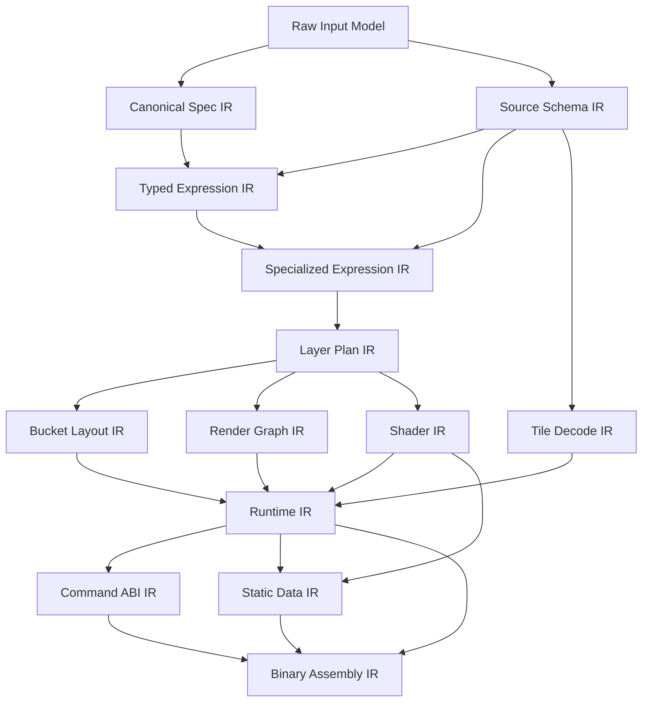

# Intermediate Representations for the Terra AOT Map Compiler

## Complete IR Specification

## Purpose

This document defines the complete intermediate representation stack for the Terra ahead-of-time map compiler.

This is the most critical compiler document in the project. The IR stack is the backbone of the system. It determines:

- what information exists at each phase,
- what transformations are legal,
- where specialization happens,
- how contracts flow into code generation,
- how correctness and debuggability are preserved.

This document is written to support both human implementers and AI coding agents.

---

## 1. Design goals for the IR stack

The IR system must satisfy the following goals:

1. **Phase separation**
   Each IR must have a clear purpose and invariant boundary.

2. **Loss budgeting**
   Every lowering step must document what information is preserved, normalized, enriched, or discarded.

3. **Specialization friendliness**
   The IRs must make compile-time evaluation and branch pruning easy.

4. **Schema awareness**
   Property access must become typed and slot-based as early as possible.

5. **Backend independence where useful**
   Higher IRs should not depend on WebGL2-specific syntax.

6. **Backend specificity where valuable**
   Lower IRs should carry exact layout and emission details needed for Wasm and shader generation.

7. **Determinism**
   IR node ordering and identifiers must be stable under deterministic builds.

8. **Debuggability**
   It must be possible to dump, diff, and inspect all important IRs.

---

## 2. Global IR pipeline

The compiler shall use the following primary IRs:

1. Raw Input Model
2. Canonical Spec IR
3. Source Schema IR
4. Typed Expression IR
5. Specialized Expression IR
6. Layer Plan IR
7. Tile Decode IR
8. Bucket Layout IR
9. Render Graph IR
10. Shader IR
11. Runtime IR
12. Command ABI IR
13. Static Data IR
14. Binary Assembly IR

These are not all the same kind of thing. Some are graph IRs, some are plan IRs, some are binary layout IRs. They are all “intermediate representations” in the broad compiler sense.

---

## 3. IR dependency graph



---

## 4. IR taxonomy

### 4.1 Semantic IRs

These encode user-visible meaning:
- Canonical Spec IR
- Typed Expression IR
- Specialized Expression IR
- Layer Plan IR

### 4.2 Structural IRs

These encode typed, organized program structure:
- Source Schema IR
- Tile Decode IR
- Bucket Layout IR
- Render Graph IR
- Runtime IR

### 4.3 Backend IRs

These encode target-facing structures:
- Shader IR
- Command ABI IR
- Static Data IR
- Binary Assembly IR

---

## 5. Common IR conventions

All IRs should follow these conventions unless there is a strong reason not to.

### 5.1 Stable identifiers

Every important entity gets a stable compiler-assigned id:
- source ids,
- source-layer ids,
- layer ids,
- property-slot ids,
- expression ids,
- shader program ids,
- bucket layout ids,
- state block ids,
- resource ids.

### 5.2 Explicit typing

Every node with a value must record its type.

### 5.3 Explicit provenance

Important nodes should carry provenance metadata:
- spec path,
- source file,
- layer/source context,
- original user id where relevant.

### 5.4 Explicit dependency class

Any value that may vary by runtime context must declare its dependency class.

### 5.5 Versioned dump formats

Every dumpable IR should have a versioned textual or JSON dump schema.

### 5.6 No hidden defaults below Canonical Spec IR

After canonicalization, defaults must be explicit.

---

## 6. Raw Input Model

## 6.1 Purpose

The Raw Input Model is the direct parsed representation of the compile spec, source schema, and asset metadata before semantic canonicalization.

## 6.2 Responsibilities

- preserve original field ordering when useful for diagnostics,
- preserve user-authored ids and structure,
- distinguish absent values from explicit values,
- attach source locations.

## 6.3 Invariants

- JSON shape is syntactically valid,
- schema validation may still not be complete,
- defaults are not yet inserted,
- references may be unresolved.

## 6.4 Typical contents

- raw style object tree,
- raw source descriptors,
- raw schema descriptors,
- raw asset descriptors,
- raw target/build constraints.

## 6.5 What it must not do yet

- assign stable internal ids,
- resolve style defaults,
- infer types,
- lower expressions.

---

## 7. Canonical Spec IR

## 7.1 Purpose

Canonical Spec IR is the first true semantic IR. It transforms user-authored input into a normalized, fully explicit, compiler-friendly representation of the map specification.

## 7.2 Responsibilities

- resolve defaults,
- normalize property names and units,
- resolve references,
- assign stable ids,
- flatten style structure,
- create canonical layer ordering,
- preserve semantic equivalence.

## 7.3 Invariants

- all defaults are explicit,
- source and layer references are resolved,
- layer order is final,
- all ids are stable and deterministic,
- unsupported constructs may still exist but are explicit.

## 7.4 Main entities

### Source
- `SourceId`
- source kind
- tile URL template or fetch descriptor
- minzoom/maxzoom
- extent
- source-level flags

### SourceLayerRef
- `SourceLayerId`
- source binding
- user name
- stable name

### Layer
- `LayerId`
- kind
- source binding
- source-layer binding
- minzoom/maxzoom
- filter expression root reference
- paint properties
- layout properties
- layer order index

### AssetRef
- sprite/glyph/image/texture references

## 7.5 Data example

```text
Layer {
  id: LAYER_004,
  user_name: "roads-major",
  kind: LINE,
  source_id: SRC_001,
  source_layer_id: SL_003,
  order: 12,
  minzoom: 5,
  maxzoom: 24,
  filter_raw_expr: EXPR_RAW_118,
  paint: {...explicit defaults...},
  layout: {...explicit defaults...},
  provenance: spec.layers[7]
}
```

## 7.6 Information preserved

- semantic style meaning,
- user ids and names,
- source paths,
- original layer ordering intent.

## 7.7 Information added

- resolved references,
- explicit defaults,
- stable ids,
- canonical ordering.

## 7.8 Information discarded

- syntactic sugar forms,
- ambiguous absent/default distinction.

---

## 8. Source Schema IR

## 8.1 Purpose

Source Schema IR represents the typed shape of the data sources known at compile time.

It is essential for specialization.

## 8.2 Responsibilities

- represent source layers and geometry kinds,
- assign property slots,
- define property types and value domains,
- define enum dictionaries,
- define default/nullability semantics,
- support slot-based property lowering.

## 8.3 Invariants

- each referenced source layer has a stable schema record,
- every declared property has a stable slot id,
- enum dictionaries are canonicalized,
- type information is explicit.

## 8.4 Main entities

### SchemaSource
- `SourceId`
- referenced source layers

### SchemaLayer
- `SourceLayerId`
- geometry kind(s)
- property table

### PropertySlot
- `PropertySlotId`
- property name
- value type
- default value
- enum dictionary id if any
- nullable flag

### EnumDictionary
- `EnumDictId`
- stable ordered mapping from string values to compact ids

## 8.5 Information preserved

- declared data shape,
- source-layer grouping,
- enum semantics.

## 8.6 Information added

- slot ids,
- compact enum ids,
- normalized type descriptors.

## 8.7 Example

```text
PropertySlot {
  slot_id: PS_004,
  name: "class",
  type: ENUM,
  enum_dict: ED_002,
  nullable: false,
  default_value: ENUM(LOCAL_STREET)
}
```

---

## 9. Typed Expression IR

## 9.1 Purpose

Typed Expression IR turns style expressions into typed, analyzable expression trees or DAGs.

This is the main semantic IR for style logic.

## 9.2 Responsibilities

- parse style expressions into normalized nodes,
- infer or validate result types,
- attach dependency classes,
- attach source property dependencies,
- classify purity and constantness,
- enable later specialization.

## 9.3 Invariants

- every expression has a known result type,
- every expression has a dependency class,
- property references are resolved against schema where possible,
- invalid type combinations are rejected,
- expressions are side-effect free.

## 9.4 Core node kinds

### Value nodes
- Literal
- Zoom
- PropertyLoad
- FeatureStateLoad (if enabled)
- RuntimeParamLoad

### Control nodes
- Match
- Case
- Let
- Select

### Numeric nodes
- Add
- Sub
- Mul
- Div
- Neg
- Clamp
- Min
- Max
- Interpolate

### Logical nodes
- And
- Or
- Not

### Comparison nodes
- Eq
- Ne
- Lt
- Le
- Gt
- Ge
- In
- Has

### Conversion nodes
- ToBool
- ToNumber
- ToColor
- ToEnum

### Structural nodes
- Tuple/Vector constructor
- Color constructor

## 9.5 Expression typing model

Supported initial types:
- `BOOL`
- `I32`
- `F32`
- `COLOR`
- `ENUM(dict)`
- `STRING` only in early lowering/debug contexts
- `VEC2`, `VEC3`, `VEC4` as needed

## 9.6 Dependency classes

Every expression root and subnode gets one of:
- `CONST_GLOBAL`
- `CONST_STYLE`
- `PER_FRAME`
- `PER_TILE`
- `PER_FEATURE`
- `PER_INTERACTION`

## 9.7 Metadata on each node

Each node should carry:
- `ExprId`
- node kind
- result type
- dependency class
- purity flag
- const flag
- estimated cost
- provenance
- list of property slot dependencies

## 9.8 Example

```text
MatchExpr {
  expr_id: E_118,
  result_type: F32,
  dep: PER_FEATURE,
  input: PropertyLoad(slot=PS_004, type=ENUM(ED_002)),
  arms: [
    ENUM(MOTORWAY) -> Literal(4.0),
    ENUM(PRIMARY) -> Literal(2.0)
  ],
  default: Literal(1.0)
}
```

## 9.9 Information preserved

- style semantics,
- exact expression logic,
- dependencies on zoom/properties.

## 9.10 Information added

- explicit types,
- explicit schema slots,
- dependency classes,
- cost estimates.

---

## 10. Specialized Expression IR

## 10.1 Purpose

Specialized Expression IR is the result of compile-time simplification and restructuring of Typed Expression IR.

This is not just “optimized expression IR.” It is the expression layer after partial evaluation and phase separation.

## 10.2 Responsibilities

- fold constants,
- hoist frame/tile/style computations,
- eliminate dead branches,
- lower enum matches,
- turn generic control into execution-friendly specialized forms,
- separate hot-path feature evaluation from precompute paths.

## 10.3 Invariants

- no avoidable constant subtrees remain,
- no unresolved schema string property accesses remain,
- dynamic work is minimized,
- hoisted values are explicitly materialized as precompute bindings,
- branch shapes are reduced where possible.

## 10.4 Common specialized forms

### HoistedValueRef
Reference to a precomputed value produced per frame or per tile.

### DenseEnumSwitch
A compact match form over enum ids.

### FoldedLiteral
A literal produced by compile-time evaluation.

### SimplifiedInterpolate
A compact interpolation with pre-normalized stops.

### PredicateChain
A flattened fast-path boolean chain.

## 10.5 Invariants by dependency class

- `CONST_*` nodes should become literals or embedded constants,
- `PER_FRAME` nodes should be materializable into frame uniform or precompute state,
- `PER_TILE` nodes should be materializable during tile preparation,
- `PER_FEATURE` nodes remain in bucket construction or shader input generation,
- `PER_INTERACTION` nodes remain only if explicitly allowed.

## 10.6 Example transformation

Input:
```text
interpolate(zoom, [5->1, 10->2, 15->4]) * 2
```

Output:
```text
HoistedValueRef(HV_013)
```

with separate precompute record:
```text
HoistedValue {
  id: HV_013,
  phase: PER_FRAME,
  expr: SimplifiedInterpolate(stops=[...], scale=2)
}
```

## 10.7 Information preserved

- semantic meaning.

## 10.8 Information added

- phase placement,
- precompute bindings,
- lowered switch structures,
- branch simplification.

## 10.9 Information discarded

- original user-facing expression structure where equivalent reduced forms exist.

---

## 11. Layer Plan IR

## 11.1 Purpose

Layer Plan IR describes exactly how each compiled layer should be implemented.

It is the bridge between semantic style logic and runtime rendering machinery.

## 11.2 Responsibilities

- bind layer to source and source layer,
- bind specialized filter and property evaluators,
- choose bucket family,
- choose attribute layout,
- choose uniform layout,
- choose state block,
- choose shader family,
- encode per-layer support decisions.

## 11.3 Invariants

- each supported layer has one final plan,
- all style semantics used by rendering are resolved to lower-level contracts,
- no unresolved style property lookups remain,
- unsupported backend requirements are already rejected.

## 11.4 Main entities

### LayerPlan
- `LayerId`
- layer family
- source binding
- source-layer binding
- filter evaluator id
- feature evaluator ids
- bucket kind id
- attribute layout id
- uniform layout id
- state block id
- shader family id
- draw policy

### StateBlock
- blend mode
- depth/stencil mode
- cull mode
- draw topology

### FeatureEvaluatorBinding
- what values must be computed per feature
- where they end up (vertex attribute, bucket metadata, uniform input)

## 11.5 Example

```text
LayerPlan {
  layer_id: LAYER_004,
  family: LINE,
  source_id: SRC_001,
  source_layer_id: SL_003,
  filter_eval: FE_011,
  feature_evals: [FEATVAL_002, FEATVAL_003],
  bucket_kind: BK_LINE_A,
  attribute_layout: AL_007,
  uniform_layout: UL_004,
  state_block: SB_003,
  shader_family: SHF_LINE_002,
  draw_policy: DRAW_INDEXED
}
```

## 11.6 Information preserved

- per-layer semantics,
- rendering order intent.

## 11.7 Information added

- exact implementation strategy,
- state/layout/shader bindings.

---

## 12. Tile Decode IR

## 12.1 Purpose

Tile Decode IR describes how source bytes are decoded into typed feature records for the compiled module.

It exists to make the decoder selective and specialization-friendly.

## 12.2 Responsibilities

- describe which source layers are needed,
- describe which geometry kinds are needed,
- describe which properties are needed,
- describe how raw values map into typed slots,
- describe decode skipping rules.

## 12.3 Invariants

- unreferenced source layers are omitted,
- unreferenced properties are omitted,
- geometry kinds not used by compiled layers are skipped,
- schema projection rules are explicit.

## 12.4 Main entities

### DecodePlan
- source id
- tile format
- referenced source layers
- property projections
- geometry decode policy

### LayerDecodeSpec
- source-layer id
- accepted geometry kinds
- slot extraction list

### PropertyProjection
- raw field lookup rule
- slot target
- type coercion rule
- enum mapping rule
- default/null handling

## 12.5 Example

```text
LayerDecodeSpec {
  source_layer_id: SL_003,
  geometry_kinds: [LINESTRING],
  properties: [
    Project("class" -> PS_004, enum=ED_002),
    Project("bridge" -> PS_005, bool)
  ]
}
```

## 12.6 Information preserved

- source schema semantics.

## 12.7 Information added

- exact decode subset,
- projection rules,
- skip logic.

---

## 13. Bucket Layout IR

## 13.1 Purpose

Bucket Layout IR defines how renderable geometry and per-feature values are packed into bucket structures and vertex/index buffers.

## 13.2 Responsibilities

- define bucket families,
- define vertex structs,
- define index formats,
- define attribute packing strategy,
- define uniform block contents,
- define bounds metadata.

## 13.3 Invariants

- each layout is tied to a layer family and shader contract,
- packed attribute formats are explicit,
- buffer alignment and stride are explicit,
- host submission requirements are derivable.

## 13.4 Main entities

### BucketKind
- fill / line / circle kind variants
- build algorithm id

### AttributeLayout
- field list
- byte offsets
- stride
- normalization rules

### VertexField
- semantic name
- storage type
- shader location
- source evaluator id

### UniformLayout
- block fields
- byte offsets
- update frequency

## 13.5 Example

```text
AttributeLayout {
  id: AL_007,
  stride: 16,
  fields: [
    Field(name="pos", type=I16x2, offset=0, location=0),
    Field(name="extrude", type=I16x2, offset=4, location=1),
    Field(name="dist", type=U16, offset=8, location=2),
    Field(name="class_width", type=U16, offset=10, location=3)
  ]
}
```

## 13.6 Information preserved

- all values needed for rendering.

## 13.7 Information added

- exact packed binary layout,
- GPU-facing layout details.

---

## 14. Render Graph IR

## 14.1 Purpose

Render Graph IR describes the ordered execution structure of the frame.

For v0 it may be linear, but it should still be represented explicitly.

## 14.2 Responsibilities

- define render passes,
- define pass order,
- define state transitions,
- define draw family grouping,
- define resource lifetime hints per pass.

## 14.3 Invariants

- pass order is deterministic,
- draw families map to existing layer plans,
- state transitions are explicit,
- render graph is acyclic.

## 14.4 Main entities

### RenderPass
- pass id
- pass type
- clear policy
- included layer families
- state preamble

### DrawGroup
- state block id
- shader family id
- bucket layout id
- ordered layer list

## 14.5 Example

```text
RenderPass {
  id: RP_002,
  type: LINE_PASS,
  clear: NONE,
  draw_groups: [DG_006, DG_007]
}
```

## 14.6 Information preserved

- final rendering order semantics.

## 14.7 Information added

- pass boundaries,
- draw grouping.

---

## 15. Shader IR

## 15.1 Purpose

Shader IR is a backend-neutral typed representation of shader programs needed by the compiled style.

## 15.2 Responsibilities

- represent vertex and fragment stage logic,
- encode inputs, varyings, outputs, uniforms,
- support constant embedding,
- support backend-specific code generation later.

## 15.3 Invariants

- stage inputs/outputs are typed,
- referenced attributes exist in Bucket Layout IR,
- referenced uniforms exist in UniformLayout,
- all constants and helper functions are explicit.

## 15.4 Main entities

### ShaderProgramIR
- program id
- program key
- vertex stage
- fragment stage
- reflection metadata

### ShaderStageIR
- stage kind
- typed variable declarations
- entry block
- helper functions

### ShaderValue
- type
- storage class
- binding or location info

## 15.5 Example

```text
ShaderProgramIR {
  program_id: PRG_002,
  key: SHF_LINE_002,
  vertex_stage: VS_004,
  fragment_stage: FS_004,
  attributes: AL_007,
  uniforms: UL_004
}
```

## 15.6 Information preserved

- shader semantics.

## 15.7 Information added

- explicit stage/program structure,
- reflection metadata.

---

## 16. Runtime IR

## 16.1 Purpose

Runtime IR describes the internal Wasm-side program structure and state layout of the generated renderer.

## 16.2 Responsibilities

- describe runtime state structs,
- describe allocators and arenas,
- describe tile cache layout,
- describe command encoder structures,
- describe event handlers,
- describe frame execution routines.

## 16.3 Invariants

- all persistent state has an explicit layout,
- every runtime subsystem has a state root,
- all resource registries have typed entries,
- all exported functions map to runtime routines.

## 16.4 Main entities

### RuntimeModulePlan
- top-level runtime configuration
- enabled subsystems
- exported functions
- imported functions

### RuntimeStruct
- struct id
- field list
- size/alignment

### RoutinePlan
- routine id
- phase (`init`, `frame`, `resize`, `resource_loaded`, etc.)
- inputs/outputs
- dependencies on other runtime elements

### ArenaPlan
- arena kind
- growth policy
- reset policy

## 16.5 Example

```text
RoutinePlan {
  id: RTN_FRAME_001,
  phase: FRAME,
  reads: [CameraState, TileCache, BucketStore],
  writes: [FrameArena, CommandArena, Stats],
  calls: [select_visible_tiles, cull_buckets, encode_frame]
}
```

## 16.6 Information preserved

- runtime behavior plan.

## 16.7 Information added

- exact state layout and routine boundaries.

---

## 17. Command ABI IR

## 17.1 Purpose

Command ABI IR models the binary command protocol and host import/export boundary as compiler data, not just documentation.

## 17.2 Responsibilities

- define command opcodes,
- define payload structs,
- define handle types,
- define import/export signatures,
- define validation metadata.

## 17.3 Invariants

- all emitted commands correspond to known opcodes,
- command payloads are layout-stable,
- command generation is host-contract aware,
- every exported function has a typed ABI description.

## 17.4 Main entities

### OpcodeDef
- opcode value
- payload struct id
- alignment requirement
- validation rule set

### AbiFunctionDef
- import/export
- name
- typed signature
- status code semantics

### HandleTypeDef
- program handle
- buffer handle
- texture handle
- request id

## 17.5 Example

```text
OpcodeDef {
  opcode: DRAW_INDEXED,
  payload: CmdDrawIndexed,
  align: 4,
  validate: [buffer_bound, count_nonzero]
}
```

---

## 18. Static Data IR

## 18.1 Purpose

Static Data IR models all compile-time data blobs that will be embedded into or alongside the Wasm binary.

## 18.2 Responsibilities

- collect immutable lookup tables,
- collect enum dictionaries,
- collect shader source blobs or program metadata,
- collect layer tables,
- collect string tables,
- collect debug metadata when enabled.

## 18.3 Invariants

- static blobs are deduplicated where appropriate,
- blob alignment is explicit,
- symbolic references are resolvable during binary assembly.

## 18.4 Main entities

### DataBlob
- blob id
- kind
- byte contents or symbolic source
- size/alignment

### LookupTable
- key type
- value type
- table format

### StringTable
- interned strings
- offset map

---

## 19. Binary Assembly IR

## 19.1 Purpose

Binary Assembly IR is the final compiler-level representation of everything needed to emit the `.wasm` artifact and optional manifests.

## 19.2 Responsibilities

- assemble code sections,
- assemble static data sections,
- assign final symbol ids,
- assign final offsets,
- emit manifests and build reports.

## 19.3 Invariants

- every symbolic reference is resolved,
- code and data ordering is deterministic,
- ABI/version headers are present,
- final output is target-valid.

## 19.4 Main entities

### BinaryModule
- target triple/profile
- function bodies
- static segments
- export table
- import table
- custom/debug sections

### SectionPlan
- section kind
- ordered payload list
- alignment rules

### SymbolResolution
- symbol id
- final offset or index

---

## 20. Cross-IR mapping table

| From IR | To IR | Main transformation |
|---|---|---|
| Raw Input Model | Canonical Spec IR | Normalize structure, insert defaults, resolve refs |
| Raw Input Model | Source Schema IR | Normalize schema, assign slots, build enum dicts |
| Canonical Spec IR + Source Schema IR | Typed Expression IR | Parse and type expressions, resolve property references |
| Typed Expression IR | Specialized Expression IR | Constant fold, hoist, simplify, branch-prune |
| Specialized Expression IR | Layer Plan IR | Bind implementation strategy per layer |
| Source Schema IR | Tile Decode IR | Select decode subset and projection rules |
| Layer Plan IR | Bucket Layout IR | Choose bucket families and packed layouts |
| Layer Plan IR | Render Graph IR | Build pass order and draw grouping |
| Layer Plan IR | Shader IR | Build stage logic and reflection |
| Decode/Bucket/Render/Shader | Runtime IR | Build runtime state and routines |
| Runtime IR | Command ABI IR | Bind command emission and host contract |
| Runtime/Shader/etc. | Static Data IR | Collect immutable data blobs |
| Runtime/CmdABI/StaticData | Binary Assembly IR | Produce final module plan |

---

## 21. Mutation policy by IR

Different passes may mutate different IRs. This must be explicit.

### 21.1 Mutable during creation only
- Raw Input Model
- Canonical Spec IR
- Source Schema IR

After creation, these should be treated as immutable snapshots.

### 21.2 Transformational IRs
- Typed Expression IR
- Specialized Expression IR

These may be rebuilt or rewritten by compiler passes, but each pass should emit a fresh version or a clearly versioned transformed graph.

### 21.3 Planning IRs
- Layer Plan IR
- Tile Decode IR
- Bucket Layout IR
- Render Graph IR
- Shader IR
- Runtime IR

These should be append-only or rebuilt in clearly staged passes, not mutated ad hoc.

### 21.4 Assembly IRs
- Command ABI IR
- Static Data IR
- Binary Assembly IR

These should be treated as finalization structures.

---

## 22. Required dump formats

The compiler must support dumping at least these IRs:

- Canonical Spec IR
- Source Schema IR
- Typed Expression IR
- Specialized Expression IR
- Layer Plan IR
- Tile Decode IR
- Bucket Layout IR
- Render Graph IR
- Shader IR
- Runtime IR
- Command ABI IR
- Static Data IR

Each dump should include:
- version,
- compiler version,
- build hash,
- stable ids,
- provenance links where possible.

---

## 23. Required validations per IR

### Raw Input Model
- JSON syntax
- top-level shape

### Canonical Spec IR
- resolved references
- valid layer order
- explicit defaults inserted

### Source Schema IR
- unique slots
- valid enum dictionaries
- valid type descriptors

### Typed Expression IR
- type correctness
- dependency class assignment
- property slot resolution

### Specialized Expression IR
- no avoidable constant subtrees
- hoist placements valid
- dead branches removed where proven

### Layer Plan IR
- supported layer family
- bucket/layout/shader bindings complete

### Tile Decode IR
- all referenced properties exist in schema
- no unreachable decode work remains

### Bucket Layout IR
- attribute offsets and stride valid
- shader input compatibility

### Render Graph IR
- acyclic graph
- valid pass order

### Shader IR
- type-consistent stage interfaces
- valid resource references

### Runtime IR
- no unresolved subsystem references
- valid routine dependencies

### Command ABI IR
- unique opcodes
- valid payload sizes and signatures

### Static Data IR
- deduped references valid
- blob alignments valid

### Binary Assembly IR
- all symbol references resolved
- deterministic section ordering

---

## 24. IR ownership by compiler subsystem

```mermaid
flowchart TB
    Parser[Parser / Canonicalizer] --> Canonical[Canonical Spec IR]
    SchemaBuilder[Schema Builder] --> SchemaIR[Source Schema IR]
    ExprLowerer[Expression Lowerer] --> TypedExpr[Typed Expression IR]
    Specializer[Specializer] --> SpecExpr[Specialized Expression IR]
    Planner[Layer Planner] --> LayerPlan[Layer Plan IR]
    DecodePlanner[Decode Planner] --> DecodeIR[Tile Decode IR]
    BucketPlanner[Bucket Planner] --> BucketIR[Bucket Layout IR]
    RenderPlanner[Render Planner] --> RenderIR[Render Graph IR]
    ShaderGen[Shader Generator] --> ShaderIR[Shader IR]
    RuntimeGen[Runtime Generator] --> RuntimeIR[Runtime IR]
    AbiGen[ABI Generator] --> CmdIR[Command ABI IR]
    DataCollector[Static Data Collector] --> StaticIR[Static Data IR]
    Assembler[Binary Assembler] --> BinaryIR[Binary Assembly IR]
```



---

## 25. Recommended implementation order for IRs

The IR stack should be implemented in this order:

1. Raw Input Model
2. Canonical Spec IR
3. Source Schema IR
4. Typed Expression IR
5. Specialized Expression IR
6. Layer Plan IR
7. Tile Decode IR
8. Bucket Layout IR
9. Render Graph IR
10. Shader IR
11. Runtime IR
12. Command ABI IR
13. Static Data IR
14. Binary Assembly IR

This order follows dependency pressure and minimizes rewrite risk.

---

## 26. Critical design rules

1. Never let backend-specific concerns leak upward into Canonical Spec IR.
2. Never keep string-based property access below Typed Expression IR if schema lock is active.
3. Never let Specialized Expression IR reintroduce generic interpretation.
4. Layer Plan IR must be the first place where implementation strategy becomes explicit.
5. Bucket Layout IR and Shader IR must be compatible by construction, not by later patching.
6. Runtime IR must not infer semantics that should already be decided by higher IRs.
7. Command ABI IR must be generated from structured data, not handwritten ad hoc at emit time.
8. Binary Assembly IR must be deterministic.

---

## 27. Minimal viable IR slice for v0

If implementation must start small, the minimum viable subset is:

- Canonical Spec IR
- Source Schema IR
- Typed Expression IR
- Specialized Expression IR
- Layer Plan IR
- Bucket Layout IR
- Shader IR
- Runtime IR
- Command ABI IR
- Binary Assembly IR

Tile Decode IR and Render Graph IR may start simplified, but they should still exist conceptually even if reduced.

---

## 28. Final summary

The IR stack is the core of the compiler.

A good way to think about the full sequence is:

- **Canonical Spec IR** says what the map means.
- **Source Schema IR** says what the data looks like.
- **Typed and Specialized Expression IRs** say how style logic computes.
- **Layer Plan / Decode / Bucket / Render IRs** say how the map will be implemented.
- **Shader / Runtime / Command ABI IRs** say how the renderer will execute.
- **Static Data / Binary Assembly IRs** say how the final artifact is built.

If these IR boundaries are designed well, the rest of the project becomes tractable. If they are designed poorly, every subsystem will leak into every other subsystem.

This document should be treated as the compiler architecture keystone.

